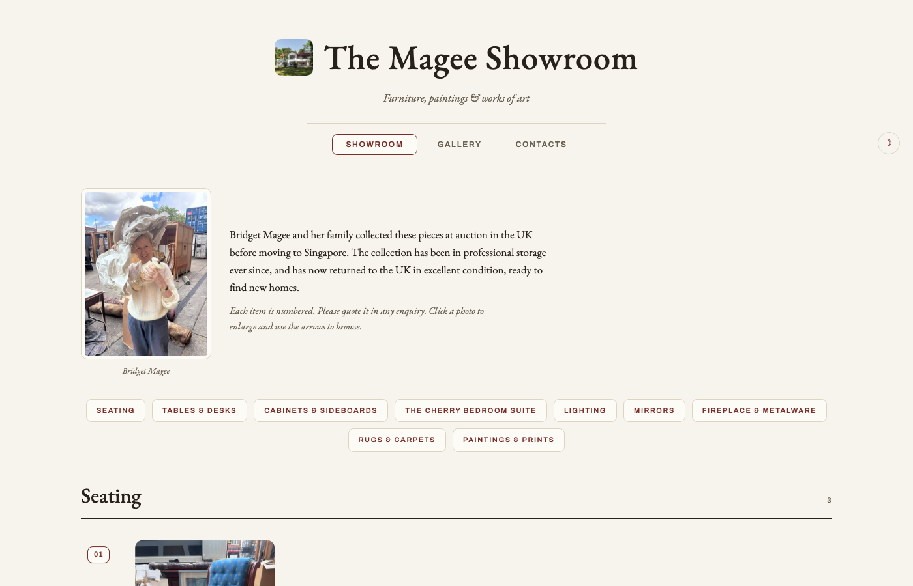

# The Magee Showroom

A one-page catalogue of the Magee family collection, built to show auction houses and family what is coming out of storage.

[Website](https://ianduncanmagee.com) · [LinkedIn](https://www.linkedin.com/in/ianduncanmagee) · [GitHub](https://github.com/AladdinYan) · [Substack](https://substack.com/@worldaccordingtoian)



## What it does

- Presents 36 numbered items across nine categories, each with a photo carousel and description
- A Gallery tab shows all 128 photographs in a filterable masonry wall
- Click any photo for a full-size viewer with keyboard navigation and a jump back to the item
- Light and dark view with a one-click toggle
- Contacts tab with an enquiry form (email hookup pending)

## Built with

Hand-written HTML, CSS and vanilla JavaScript in a single self-contained file; photos embedded as data URIs; EB Garamond and Archivo via Google Fonts.

## How to run it

Open `index.html` in a browser. That is the whole site.

```bash
open index.html
```

## Status

Live. Next: connect the enquiry form to email, then a separate valuation pass on the paintings.

## Project structure

```
magee-showroom/
├── index.html        # the entire site, photos included
└── assets/readme/    # README hero image
```

All photographs are family property. All rights reserved; no reuse without permission.
